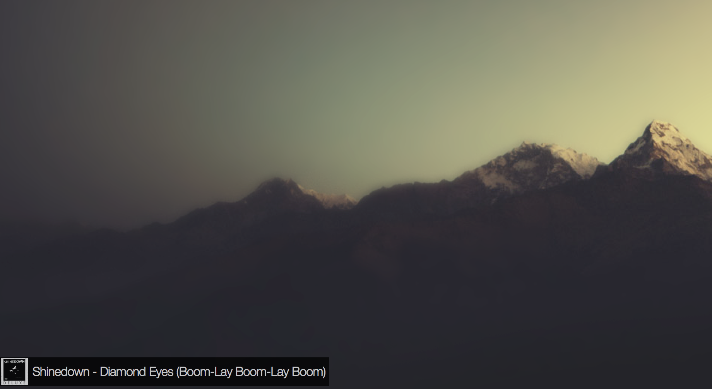

# Strichetto

A minimal, unobtrusive jacket for [Simplify](http://mmth.us/simplify/).

Strichetto is meant to be used on top of other windows, placed in the bottom-right corner of your screen.

## Usage

Double click `stricketto.jacket` and you're done. Enjoy!